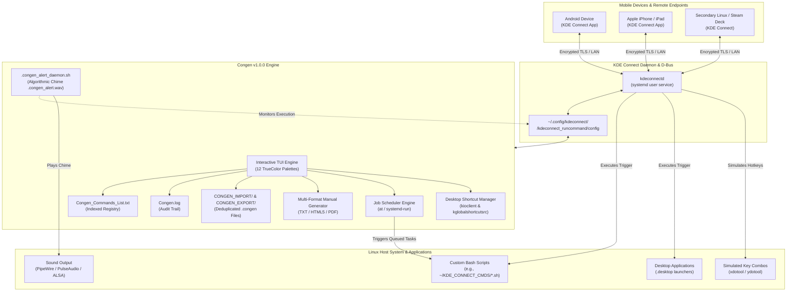

# Congen v1.0.0 by Dreamworlds Productions (MPlanetarian)

> 📅 **Last Updated:** October 9, 2026 • **Latest Release:** `v1.0.0 Stable` • **Platform:** Linux (KDE Plasma 6 & 5)

[](LICENSE)
[](https://kde.org/plasma-desktop/)
[](https://github.com/mplanetarian/Congen)
[](https://www.gnu.org/software/bash/)
[](https://www.python.org/)
[](https://wayland.freedesktop.org/)
[-f72585.svg)](#-12-curated-themes--color-palettes)

**Congen** is an enterprise-grade, terminal-based KDE Connect command orchestration suite and interactive CLI manager designed for Linux and KDE Plasma (Plasma 6 & 5). It bridges your desktop environment, custom scripts, application launchers, and hardware shortcuts with paired mobile devices (Android, iPhone / iOS, and secondary Linux machines), enabling seamless remote execution, automated scheduling, batch synchronization, and real-time auditory execution feedback.

Whether used as a standalone terminal suite or integrated within the [MP Mix Manager](file:///var/home/mplanetarian/MP_Mix_Manager_v0.3/README.md) workstation console, Congen provides a complete management interface for your remote control ecosystem.

---

## 🖥️ Terminal Interface Preview

```text
  ██████╗  ██████╗ ███╗   ██╗ ██████╗ ███████╗███╗   ██╗
 ██╔════╝ ██╔═══██╗████╗  ██║██╔════╝ ██╔════╝████╗  ██║
 ██║      ██║   ██║██╔██╗ ██║██║  ███╗█████╗  ██╔██╗ ██║
 ██║      ██║   ██║██║╚██╗██║██║   ██║██╔══╝  ██║╚██╗██║
 ╚██████╗ ╚██████╔╝██║ ╚████║╚██████╔╝███████╗██║ ╚████║
  ╚═════╝  ╚═════╝ ╚═╝  ╚═══╝ ╚═════╝ ╚══════╝╚═╝  ╚═══╝

 KDE Connect Commands Generator   v1.0.0
 Theme: MPlanetarian Dreamworlds [Default]

 Service Status   :  ● Enabled  (systemd user session)
 Network Status   :  ● Up  — wlp2s0 (Wi-Fi)  [192.168.1.120]
 Commands Installed: 3

 ── Live Monitor ────────────────────────────────────────────
 Active Runs      :  ○ None
 Total Runs       :  18 recorded
 Last Success     :  2026-10-09 03:36:27 — Run Resident Evil 9
 Last Failure     :  None recorded
 ────────────────────────────────────────────────────────────

  Main Menu

    [1]  Create new KDE Connect command
    [2]  View installed KDE Connect commands  (+ remove)
    [3]  Run a KDE Connect command
    [4]  Schedule Congen Commands              (future / sequential)
    [5]  View Congen Log                       (Congen.log)
    [6]  Congen Management                     (export / import)
    [7]  Generate Congen Commands Manual (Multi)
    [8]  Congen Alerts                         (sound notifications)
    [9]  Generate Command from Keyboard Shortcut
    [10] 🖥️  Desktop Shortcut Management         (Run, Bind Keys & Schedule — KDE Plasma)
    [11] 🎨 Themes & Color Palette Switcher        (12 Themes: Dreamworlds, Dreamworlds Ultra...)
    [q]  Quit
```

---

## 🔄 System Architecture & Data Flow



---

## ✨ Comprehensive Feature Matrix

| Menu Option | Feature Name | Core Functionality & Technical Scope |
| :---: | :--- | :--- |
| **`[1]`** | **Create New Command** | Guided interactive wizard to register commands into KDE Connect. Performs executable validation, checks script existence, prompts to `chmod +x`, sanitizes command names, and targets either a specific paired device or all devices simultaneously. |
| **`[2]`** | **View & Remove Commands** | Complete catalog browser detailing command names, unique config keys, associated devices, and script paths. Features instant one-key removal with synchronized cleanup of KDE Connect INI configuration and catalog files. |
| **`[3]`** | **Run Command Directly** | In-terminal command runner allowing immediate local testing and execution of any configured KDE Connect action without touching a paired phone. |
| **`[4]`** | **Task Scheduler Engine** | Dual-backend scheduler supporting both POSIX `at` and `systemd-run` transient user timer units. Enables one-off future execution, sequential task pipelines, queue monitoring, and pending job cancellation (`Congen_Schedule.txt`). |
| **`[5]`** | **Audit & Diagnostic Log** | Persistent chronological event log (`Congen.log`) recording session starts, command creations, executions, removals, scheduled jobs, and daemon events with ISO timestamps. |
| **`[6]`** | **Congen Management** | Complete backup and synchronization suite: export installed commands to timestamped `.congen` files in `CONGEN_EXPORT/<timestamp>/`, batch-register `.congen` profiles from `CONGEN_IMPORT/`, and import native KDE Connect commands across all devices with automatic deduplication. |
| **`[7]`** | **Multi-Format Manual Generator** | Generates production-ready command documentation in three formats: structured plain text (`.txt`), responsive modern dark-mode HTML5 (`.html`), and print-ready PDF (`.pdf`) via an automated converter fallback cascade (`wkhtmltopdf` → `chromium` → `google-chrome` → `weasyprint`). |
| **`[8]`** | **Auditory Alert Daemon** | Background daemon (`.congen_alert_daemon.sh`) that monitors KDE Connect command triggers and plays a pleasant two-tone chime (`.congen_alert.wav`, 1047 Hz → 1319 Hz). Generates audio algorithmically via standard Python `wave` with zero binary dependencies. |
| **`[9]`** | **Keyboard Shortcut Generator** | Inspects active KDE global shortcuts (`~/.config/kglobalshortcutsrc`), creates standalone wrapper scripts using `xdotool` (X11) or `ydotool` (Wayland), and binds them into KDE Connect for mobile remote keyboard shortcut triggering. |
| **`[10]`** | **Desktop Shortcut Management** | Native KDE Plasma desktop launcher control: scans `~/Desktop` and application directories, executes apps via `kioclient exec`, binds desktop launchers to global keyboard hotkeys via `kwriteconfig6`, and schedules app launches. |
| **`[11]`** | **Themes & Color Switcher** | 12 hand-crafted TrueColor and ANSI-256 color palettes with persistent state (`.congen_theme`). Includes the signature *MPlanetarian Dreamworlds* neon palette and *Dreamworlds Ultra*. |

---

## 🎨 12 Curated Themes & Color Palettes

Congen features a built-in theme engine that persists your aesthetic choice across sessions in `.congen_theme`:

```
  [1]  MPlanetarian Dreamworlds   ★ ACTIVE (DEFAULT)  (Sweet Neon Red, Bright Aqua Cyan, Electric Amber, Soft Lavender, Hot Pink)
  [2]  Dreamworlds Ultra MP Mix Manager               (Hot Purple, Traffic Danger Red, Go Green, Amber Warning, Lilac)
  [3]  Cyberpunk                                      (Neon Red, Acid Green, High Voltage Yellow, Hot Pink, Cyan)
  [4]  Dracula                                        (Coral Pink, Neon Green, Pale Gold, Lavender Blue, Purple, Sky Cyan)
  [5]  Nord                                           (Nord Aurora Red, Sage Green, Polar Yellow, Slate Blue, Frost Cyan)
  [6]  Matrix                                         (Pure Phosphor Green, Electric Yellow-Green, Dark Crimson, Mint)
  [7]  Solarized                                      (Solarized Red, Green, Yellow, Blue, Magenta, Cyan)
  [8]  Tokyo Night                                    (Tokyo Coral, Sage Green, Warm Sand, Soft Blue, Neon Purple, Cyan)
  [9]  Monokai                                        (Pink/Red, Lime Green, Gold Yellow, Purple Blue, Orange, Cyan)
  [10] Gruvbox                                        (Rust Red, Olive Green, Warm Yellow, Slate Blue, Dusty Rose, Aqua)
  [11] Emerald                                        (Pure Spring Emerald, Soft Coral, Gold Amber, Deep Ocean, Mint)
  [12] Classic ANSI                                   (Standard 16-color ANSI terminal palette)
```

---

## 📦 Bundled Command Profiles (`CONGEN_IMPORT/`)

Congen ships with a pre-configured library of ready-to-import `.congen` command profiles in [CONGEN_IMPORT/](file:///var/home/mplanetarian/MP_Mix_Manager_v0.3/Congen/CONGEN_IMPORT):

* **AI & Machine Learning Suite:**
  * `Launch_Aider_Qwen25_7B.congen` — Launch Aider paired with local Qwen 2.5 7B model
  * `Launch_Beszel_Hub__Agent.congen` — Start Beszel monitoring hub and agent telemetry (:8090)
  * `Launch_dsh-mobile_DeepSeek_Harness.congen` — Launch DeepSeek mobile harness server (:3080)
  * `Launch_Full_AI__Studio_Suite.congen` — Spin up complete multi-agent AI studio stack
  * `Run_Ollama_Server_distrobox.congen` / `Stop_Ollama_Server.congen` — Start/stop Ollama local LLM server
  * `Start_WAN2GP_Profile_45_-_Low_VRAM.congen` / `Stop_WAN2GP_Server.congen` — WAN2GP AI Video & TTS engine
  * `Run_AI_Web.congen` — Open AI Web interfaces and dashboards
* **Media & Audio Production:**
  * `Open_Mix_Archive_Manager.congen` — Open the primary MP Mix Manager console
  * `Open_Strawberry__Play.congen` — Launch Strawberry Music Player and start playback
  * `Launch_Audacity_Maximized.congen` — Launch Audacity audio editor in maximized window
  * `Launch_VLC_Defasten_Videos.congen` & `Launch_VLC_NFT_Videos.congen` — VLC targeted video playback
  * `Mute_Audio.congen` / `Unmute_Audio.congen` — Toggle system audio master volume
* **Workstation & Gaming Utilities:**
  * `Open_Steam.congen` / `Launch_Steam.congen` — Launch Steam gaming client
  * `Launch_BleachBit.congen` — Launch BleachBit system disk cleaner
  * `Launch_Dolphin_File_Manager.congen` — Launch KDE Dolphin file manager
  * `Launch_Kate.congen` / `Launch_Sublime_Text.congen` / `Launch_Visual_Studio_Code.congen` — Open code editors
  * `Launch_Spectacle.congen` — Trigger KDE Spectacle screenshot tool
  * `Launch_XnView_MP.congen` — Open image browser and batch processor
* **Network & Security Controls:**
  * `Block_Internet_LAN_Only.congen` — Firewall toggle: isolate workstation to local LAN only
  * `Restore___Unblock_Internet.congen` — Firewall toggle: restore WAN internet access
* **System Power & Display:**
  * `Lock_Desktop_Screen.congen` — Lock current desktop session immediately
  * `Reboot.congen` — Graceful system reboot
  * `Shut_Down.congen` — System shutdown

> [!TIP]
> To register all bundled profiles on your system, launch Congen, choose **Option `[6]` (Congen Management)**, then select **Option `[2]` (Register KDE Connect commands inside Congen)**.

---

## 📋 System Requirements & Compatibility

* **Operating System:** Linux (x86_64, aarch64). Tested extensively on Fedora 40/41, Bazzite, SteamOS 3.x, Ubuntu 24.04+, and Arch Linux.
* **Desktop Environment:** KDE Plasma 6.x (tested against `plasmashell 6.7.4+`) and KDE Plasma 5.27 LTS.
* **Display Protocols:** Wayland (native) and X11 / XWayland.
* **Core Dependencies:**
  * `bash` (4.4 or higher, 5.0+ recommended)
  * `kdeconnect` & `kdeconnect-cli`
  * `python3` (3.8+ with standard `wave`, `struct`, `json`, `math`, `urllib` modules)
  * `systemd` (user session enabled)
* **Optional Feature Dependencies:**
  * *Scheduling (`[4]`):* `at` daemon or `systemd-run`
  * *Alert Audio Playback (`[8]`):* `pw-play` (PipeWire), `paplay` (PulseAudio), `aplay` (ALSA), `play` (SoX), or `ffplay`
  * *Keyboard Simulation (`[9]`):* `ydotool` (Wayland native) or `xdotool` (X11 / XWayland)
  * *Desktop Shortcut Management (`[10]`):* `kioclient` and `kwriteconfig6` (part of standard KDE Plasma)
  * *PDF Manual Compilation (`[7]`):* `wkhtmltopdf`, `chromium`, `google-chrome`, or `weasyprint`

---

## 🚀 Installation & Setup

### 1. Standalone Clone

```bash
git clone https://github.com/mplanetarian/Congen.git
cd Congen
chmod +x Congen .congen_alert_daemon.sh
```

### 2. Within MP Mix Manager

Congen is already located inside the MP Mix Manager workspace:

```bash
cd /var/home/mplanetarian/MP_Mix_Manager_v0.3/Congen
chmod +x Congen .congen_alert_daemon.sh
```

You can also launch Congen directly from the MP Mix Manager CLI:

```bash
mix-archive-manager --congen
```

Or from the root MP Mix Manager main menu by selecting **Option `28` (Network Services, Congen & Internet Control)**.

### 3. System-Wide Symlink (Optional)

Create a symlink in your user binary path to launch Congen from any terminal directory:

```bash
mkdir -p ~/.local/bin
ln -s "$(pwd)/Congen" ~/.local/bin/congen
```

---

## 📂 Project Architecture

```text
Congen/
├── Congen                        # Main interactive CLI executable (Bash/TUI Engine)
├── Congen_Commands_List.txt      # Registered command reference index and metadata catalog
├── Congen_Schedule.txt           # Task queue, history, and scheduled runs log
├── Congen.log                    # Chronological execution, audit, and diagnostic log
├── CONGEN_USER_MANUAL/           # Multi-format user manual output directory
│   ├── Congen_Manual.txt         # Plain text formatted manual
│   ├── Congen_Manual.html        # Responsive dark-mode HTML5 manual
│   └── Congen_Manual.pdf         # Print-ready compiled PDF manual
├── CONGEN_IMPORT/                # Ready-to-register command profiles (.congen)
├── CONGEN_EXPORT/                # Timestamped export backups (created on export)
├── .congen_alert_daemon.sh       # Background sound notification daemon
├── .congen_alert.wav             # Algorithmic two-tone notification audio asset (1047 Hz → 1319 Hz)
├── .congen_alerts.pid            # Daemon process ID tracking lock file
├── .congen_alerts_enabled        # Daemon enable state flag
├── .congen_theme                 # Persistent active theme configuration file
├── .congen_jobs/                 # Internal job spool directory for scheduled runs
├── .gitignore                    # Runtime locks and cache ignore definitions
└── README.md                     # Comprehensive system documentation
```

---

## 🔧 Technical Details: KDE Connect Storage Architecture

KDE Connect stores user-defined run-commands inside device-specific plugin directories under `~/.config/kdeconnect/`:

```text
~/.config/kdeconnect/
├── <device_id_1>/
│   ├── config                                  # Device metadata (e.g. name=Pixel 8)
│   └── kdeconnect_runcommand/
│       └── config                              # INI configuration containing commands=
└── <device_id_2>/
    ├── config                                  # Device metadata (e.g. name=iPhone)
    └── kdeconnect_runcommand/
        └── config                              # INI configuration containing commands=
```

### INI Configuration Format
In modern KDE Connect (version 21.x+ and KDE Plasma 6), command entries are stored as escaped JSON dictionaries wrapped in Qt byte-array markers:

```ini
[General]
commands=@ByteArray({"cmd_uuid":{"command":"/path/to/script.sh","name":"My Command"}})
```

Congen abstracts this internal Qt escaping mechanism completely:
1. Validates and parses the JSON dictionary structure safely.
2. Generates unique identifiers (UUIDs / random hashes).
3. Reads device names from peer config files to present human-readable target menus.
4. Synchronizes updates across paired devices simultaneously.
5. Re-reads and regenerates device configs without restarting the KDE Connect daemon.

### Portable `.congen` Format
When exporting commands via **Option `[6]`**, Congen saves individual portable profile files structured as:

```ini
# Congen Export File
# Exported : 2026-09-20 06:37:27
[command]
name=Open Strawberry & Play
script=/home/mplanetarian/KDE_CONNECT_CMDS/kc_launch_strawberry_play.sh
device=iPhone
config_key=95dce0ef_fa5a_4257_b96c_ddfb1b387dcc
summary=Open Strawberry & Play (Imported from iPhone)
added=2026-09-20 06:37:27
```

---

## 🛠️ Troubleshooting & Diagnostics

### KDE Connect Service is Not Running
If Congen reports `Service Status: ✗ Disabled`:
```bash
# Check service status
systemctl --user status kdeconnect.service

# Start or enable the service
systemctl --user enable --now kdeconnect.service
```

### No Paired Devices Found
KDE Connect requires at least one paired and reachable device on your local network:
```bash
# Check visible and paired devices
kdeconnect-cli -l

# Pair with a discovered device
kdeconnect-cli --pair -d <device_id>
```

### Audio Alerts Daemon Not Playing Sound
Ensure an audio player is available on your system. Congen automatically detects the following in order:
1. `pw-play` (PipeWire native)
2. `paplay` (PulseAudio)
3. `aplay` (ALSA direct)
4. `play` (SoX)
5. `ffplay` (FFmpeg)

To test audio playback directly, select **Option `[8]` → Option `[3] (Test alert sound)`** from the main menu.

### Wayland Keyboard Shortcuts
When generating commands from keyboard shortcuts (`[9]`), Wayland sessions require `ydotool`:
```bash
# Fedora / Bazzite / RHEL
sudo dnf install ydotool
sudo systemctl --user enable --now ydotoold.service

# Ubuntu / Debian
sudo apt install ydotool
```
On X11 or XWayland, install `xdotool`:
```bash
sudo dnf install xdotool   # Fedora
sudo apt install xdotool   # Ubuntu
```

---

## 🤝 Contributing

Contributions, bug reports, and suggestions are welcome!

1. Fork the repository: `https://github.com/mplanetarian/Congen`
2. Create your feature branch: `git checkout -b feature/AmazingFeature`
3. Commit your changes: `git commit -m 'feat: Add AmazingFeature'`
4. Push to the branch: `git push origin feature/AmazingFeature`
5. Open a Pull Request

---

## 📄 License

This project is licensed under the **MIT License**. See the `LICENSE` file for full terms and conditions.

---

*Authored by **MPlanetarian** — Designed for KDE Plasma & Mobile Device Remote Orchestration.*