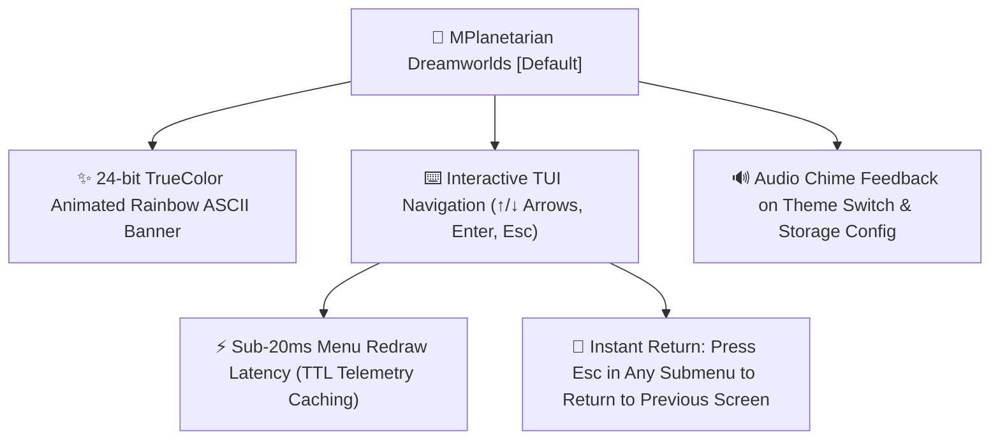
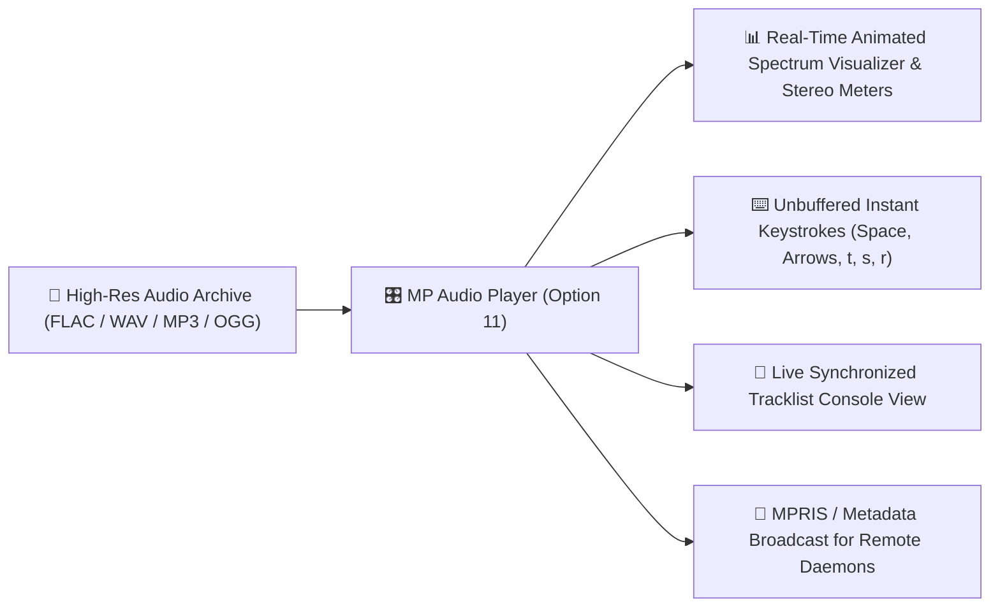
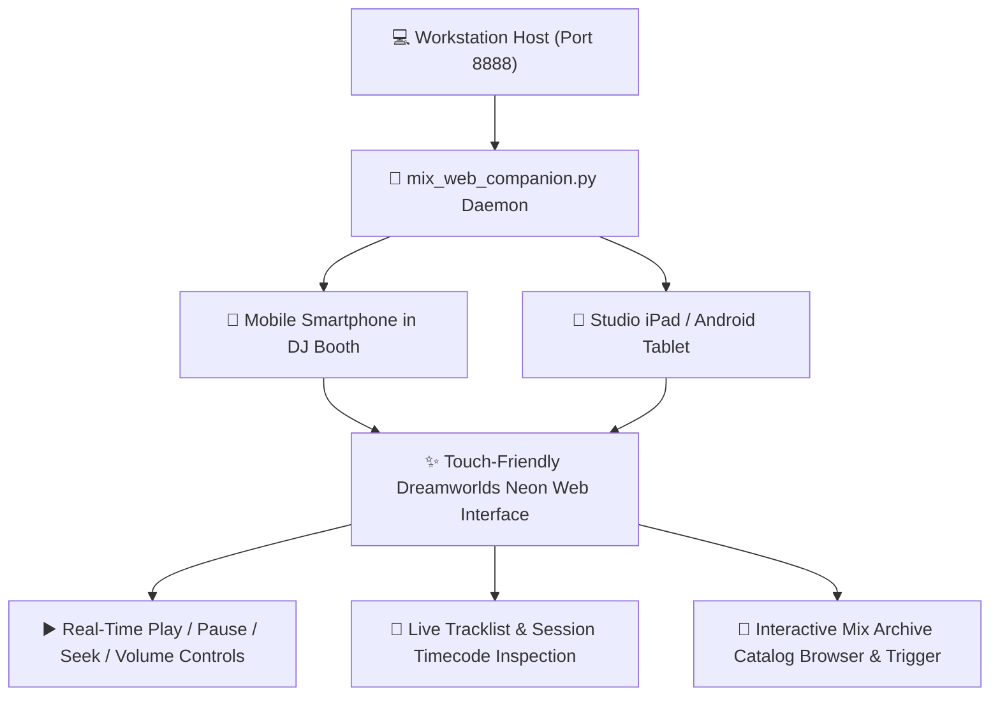
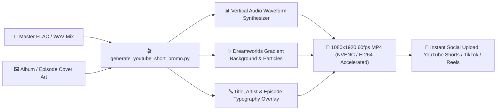
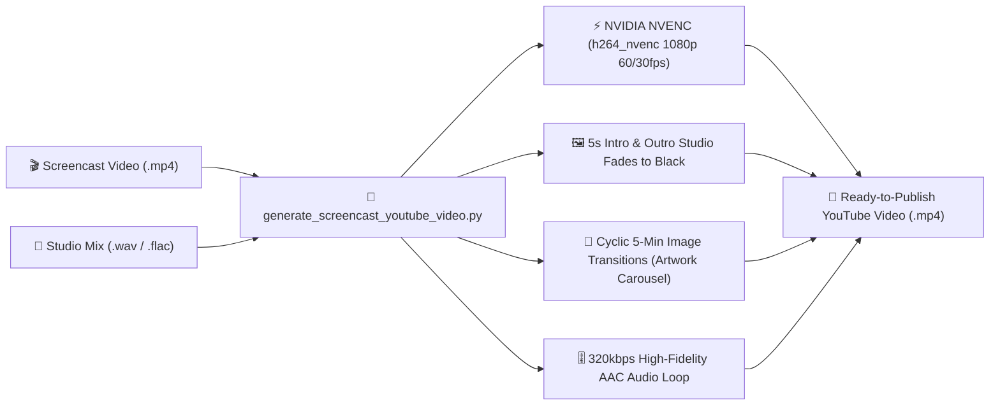
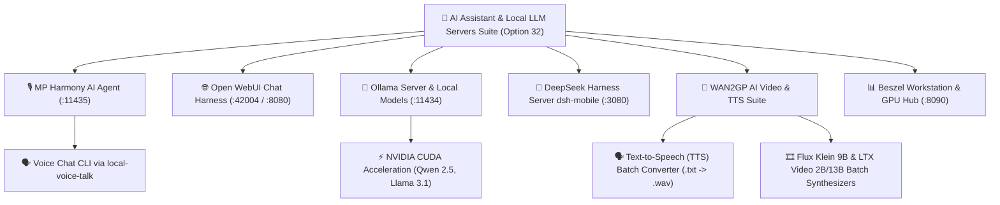
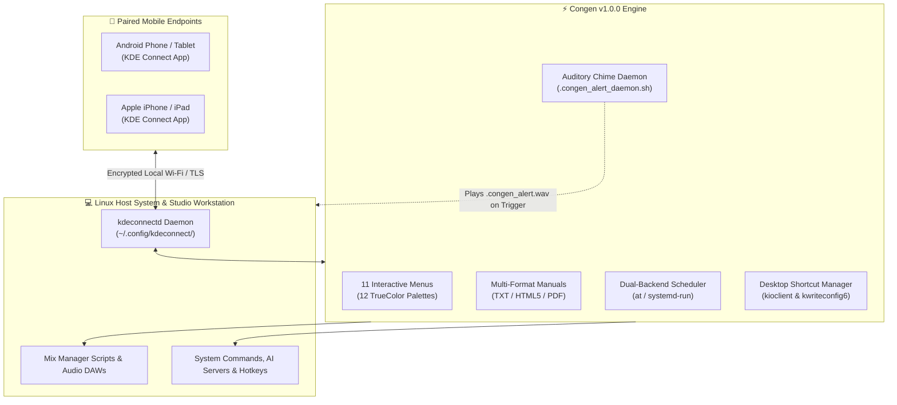
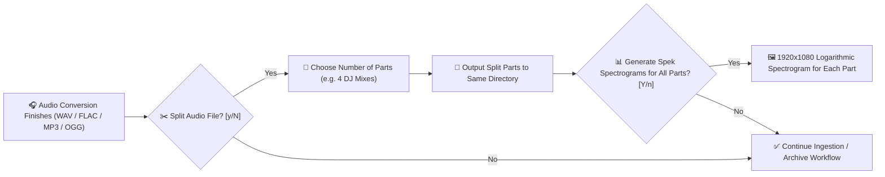
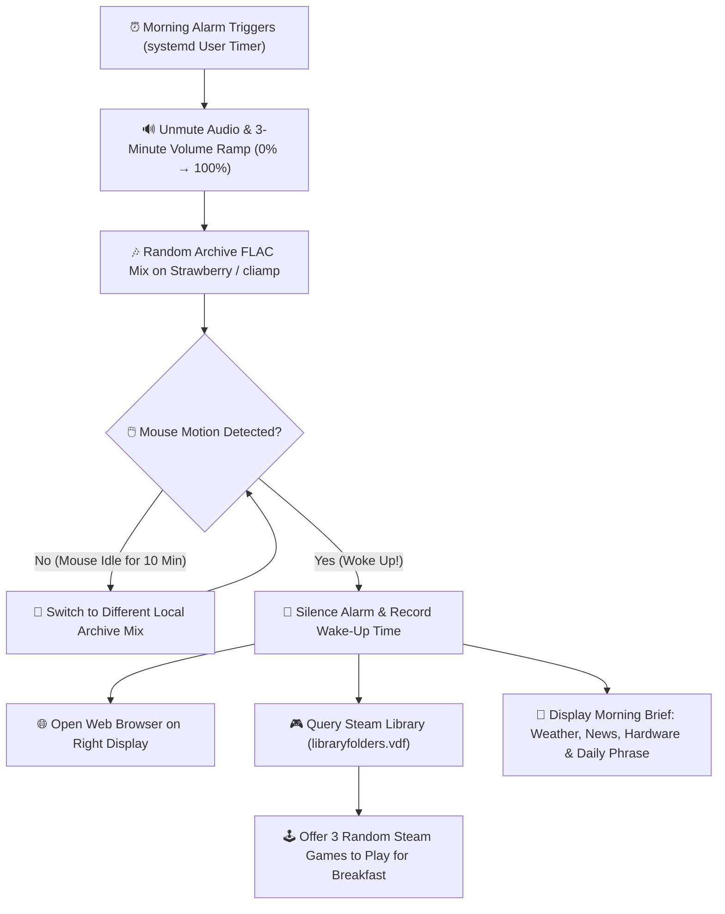
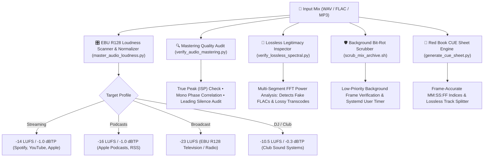

# MP Mix Manager v0.3.5 by Dreamworlds Productions (MPlanetarian)

> 📅 **Last Updated:** October 9, 2026 • **Latest Release:** `v0.3.5 Stable`

[]()
[](VERSION)
[](README.md)
[]()
[]()
[]()
[]()
[]()
[](MP_Audio_Player.py)
[](mix_web_companion.py)
[](scripts/manage_harmony_agent.sh)
[-FF5722.svg)](mplanetarians-alarm-clock/README.md)
[](Congen/README.md)
[](LICENSE)

An enterprise-grade workstation orchestration console and media management suite designed for high-resolution audio production, multi-hour DJ mix archiving, automated 32-bit FLAC mastering, Traktor Pro playlist extraction, live tracklist tracking, YouTube video synthesis, system maintenance, and AI workflow control across **Linux (Bazzite / SteamOS / Fedora / Ubuntu)**, **macOS (Latest Sequoia / Sonoma, Apple Silicon M1–M4 & Intel)**, **Microsoft Windows 10 & 11**, and **FreeBSD (14.x / 15-CURRENT)**.

---

## 📑 Table of Contents

- [🔥 What's New & Highlighted Features in v0.3.5](#-whats-new--highlighted-features-in-v035)
- [🌌 MPlanetarian Dreamworlds & TUI Navigation](#-spotlight-mplanetarian-dreamworlds--tui-navigation)
- [🎧 MP Audio Player (Terminal Audiophile Suite)](#-spotlight-mp-audio-player-terminal-audiophile-suite)
- [📱 DJ Booth & Studio Mobile Web Companion](#-spotlight-dj-booth--studio-mobile-web-companion)
- [🎬 YouTube Shorts 1080x1920 Promotional Video Generator](#-spotlight-youtube-shorts-1080x1920-promotional-video-generator)
- [🎥 Screencast YouTube Video Generator with NVENC & Image Transitions](#-spotlight-screencast-youtube-video-generator-with-nvenc--image-transitions)
- [🤖 Next-Gen AI Orchestration Suite](#-spotlight-next-gen-ai-orchestration-suite)
- [📱 Congen v1.0.0 by Dreamworlds Productions (MPlanetarian)](#-spotlight-congen-v100-by-dreamworlds-productions-mplanetarian)
- [✂️ Auto-Split DJ Mixes & Multi-Part Spek Spectrograms](#️-spotlight-auto-split-dj-mixes--multi-part-spek-spectrograms)
- [⏰ MPlanetarians Alarm Clock (Wake Up Edition)](#-spotlight-mplanetarians-alarm-clock-wake-up-edition)
- [⚡ Traktor History Harmonic Playlist & Stage Setup](#-spotlight-traktor-history-harmonic-playlist--stage-setup)
- [🎛️ EBU R128 Loudness Mastering, Audio Audit & CUE Engine](#️-spotlight-ebu-r128-loudness-mastering-audio-audit--cue-engine)
- [🔍 Audio Fingerprinting, Chapters & Rekordbox Export](#-spotlight-audio-fingerprinting-chapters--rekordbox-export)
- [🖥️ KDE Plasma Desktop Shortcuts & Global Keyboard Binder](#️-spotlight-kde-plasma-desktop-shortcuts--global-keyboard-binder)
- [📢 Unified Multi-Channel Notification Dispatcher](#-spotlight-unified-multi-channel-notification-dispatcher)
- [🚀 Quick Start by Operating System](#-quick-start-by-operating-system)
- [🎛️ Master Feature Matrix (3 Sections, Options 0–35)](#️-master-feature-matrix-3-sections-options-035)
- [💻 Command Line Interface & Direct Shortcuts](#-command-line-interface--direct-shortcuts)
- [📂 Repository & Codebase Layout](#-repository--codebase-layout)
- [⚙️ Configuration Guide (`config.env`)](#️-configuration-guide-configenv)
- [🧪 Automated Test Suite & Quality Assurance](#-automated-test-suite--quality-assurance)
- [📜 License](#-license)

---

## 🔥 What's New & Highlighted Features in v0.3.5

> [!IMPORTANT]
> **Release Highlights (`v0.3.5 Stable`):** This milestone release unifies mobile device remote orchestration, hardware-accelerated screencast video rendering, voice-driven AI autonomy, multi-archive origin-aware audio mastering, and terminal audio player rendering polish.

| Feature Area | Component | Highlights & Capability Summary |
| :--- | :--- | :--- |
| **📱 Mobile Remote Suite** | **[Congen v1.0.0](Congen/README.md)** | Full-featured KDE Connect interactive CLI manager with **11 menus**, **12 TrueColor palettes**, desktop shortcut runner/binder (`kioclient` & `kwriteconfig6`), algorithmic 2-tone synthetic chime sound daemon (`.congen_alert.wav`), multi-format manual generator (Plain Text, dark HTML5, PDF fallback cascade), mobile keyboard simulation (Wayland/X11), and 30+ bundled `.congen` profiles with multi-device deduplication. |
| **🎥 YouTube Video Suite** | **[Screencast NVENC Generator](scripts/generate_screencast_youtube_video.py)** | Generates 1080p/4K YouTube videos with NVIDIA NVENC hardware acceleration (`h264_nvenc`), 5-second intro/outro fade effects, periodic 5-second image transition cycles every 5 minutes (cycling artwork), 320kbps looped studio AAC audio, and uniform 90000 timescale stream architecture. |
| **🗣️ AI Video & Audio** | **[WAN2GP TTS Batch Suite](scripts/wan2gp_tts_batch.py)** | Integrated Text-to-Speech batch converter transforming `.txt` scripts into uncompressed `.wav` audio using British/international Neural (Edge-TTS) and offline (eSpeak-NG) voices, accompanying Flux Klein 9B and LTX Video 2B/13B video generators. |
| **🎙️ AI Voice Autonomy** | **[MP Harmony AI Voice Agent](scripts/manage_harmony_agent.sh)** | Autonomous engineering agent running on port 11435 with background setsid detachment, zero-lag port readiness wait, model tag sanitization, and an interactive **Voice Chat CLI** (`local-voice-talk` via `mix-archive-manager --harmony-voice` or Option 32.4). |
| **🎛️ Audio Mastering & Storage** | **Multi-Archive Routing** | Ingest and batch-convert across multiple physical drives (`MIX_ARCHIVE_DIR` & `EXTRA_MIX_ARCHIVE_DIRS`), with origin-aware output routing that deposits converted FLACs and spectrograms back to their respective origin drives. |
| **🎧 Terminal Audiophile Player** | **[MP Audio Player](MP_Audio_Player.py)** | "Dreamworlds Productions • Studio Audio Playback" branding, resolved TUI stair-stepping rendering artifacts, pixel-aligned visualizer frames, unbuffered zero-latency controls (`Space`, seek, volume, `t`), and flexible string path handling. |
| **📱 Social Media Outreach** | **[YouTube Shorts Generator](generate_youtube_short_promo.py)** | 1080x1920 60fps vertical promo videos with animated waveform overlays for TikTok, Instagram Reels, and YouTube Shorts. |
| **📑 Master Tracklists** | **HTML Auto-Open & Paths** | Generates master tracklists with rich file path metadata and auto-opens in default web browser. |

---

## 🌌 Spotlight: MPlanetarian Dreamworlds & TUI Navigation

> [!IMPORTANT]
> **Experience the new default aesthetic and seamless keyboard control!** Mix Archive Manager defaults to the **MPlanetarian Dreamworlds** theme — inspired by the iconic KDE Plasma Sweet / Nice neon aesthetic (sweet hot pink `#f72585`, electric coral `#ed254e`, vibrant orange `#ff7200`, electric cyan `#00e5ff`, and neon violet `#bd93f9`). It features a smooth **animated 24-bit TrueColor rainbow ASCII banner** (`render_ascii_animation.py`) and a modern **interactive TUI menu system** with arrow-key navigation, instant Enter selection, and single-key `Esc` returns across all menus.



### 🎨 Dreamworlds & TUI Features:
- 🌈 **MPlanetarian Dreamworlds Palette**: Hand-crafted 24-bit TrueColor RGB scheme matching KDE Plasma Sweet / Nice themes.
- ⚡ **Sub-20ms Redraw Latency**: Slashed main menu redraw latency from ~1.7s down to **<20ms** via intelligent TTL caching for audio sinks, telemetry, alarm states, and planetary ephemeris.
- ✨ **Animated & Static Rainbow ASCII Banner**: Live animated wave header on launch and static TrueColor banner at the top of the main menu.
- ⌨️ **Interactive Arrow-Key Navigation**: Navigate effortlessly using `Up` and `Down` arrow keys, jump with `Home` and `End`, type numbers or letters to quick-search, press `Enter` to select, and press `Esc` to instantly return to the previous screen.
- 🔊 **System Sound Feedback**: Plays soothing system audio chimes via PipeWire / ALSA when switching to Dreamworlds or configuring mix archive storage locations.
- 🎭 **12 Built-in Themes**: Dreamworlds (Default), Dreamworlds Ultra (BTOP HotPurpleTrafficLight), Cyberpunk, Dracula, Nord, Matrix, Solarized, Tokyo Night, Monokai, Gruvbox, Emerald, and Classic ANSI.

---

## 🎧 Spotlight: MP Audio Player (Terminal Audiophile Suite)

> [!TIP]
> **Built-in Audiophile Playback with Real-Time Spectrum Visualization!** Launchable directly via **Option 11** or `mix-archive-manager p`, **MP Audio Player** (`MP_Audio_Player.py`) is an in-terminal high-resolution music player engineered for seamless playback of 32-bit, 24-bit, and 16-bit FLAC, WAV, MP3, OGG, and AAC mixes.



### 🎛️ Audio Player Highlights:
- ✨ **Dreamworlds Productions • Studio Audio Playback**: Dedicated studio branding banner, real-time playback clocks, volume level gauges, and technical audio stream properties.
- 📐 **Pixel-Aligned Box Frame Architecture**: Fully resolved TUI stair-stepping rendering artifacts with clean vertical borders and synchronized multi-box terminal layout.
- 📊 **Animated TrueColor Spectrum Visualizer**: Dynamic multi-band frequency visualizer and stereo level meters rendered live inside your terminal using Dreamworlds gradients.
- ⌨️ **Unbuffered Zero-Lag Keyboard Controls**:
  - `Space`: Instant pause / play toggle.
  - `Left` / `Right` arrows: Precision seek backward / forward (5s / 30s).
  - `Up` / `Down` arrows: Volume control (0%–100%).
  - `n` / `p`: Next / Previous track in mix catalog.
  - `F`: Open currently selected / playing mix in a new desktop file manager window (Dolphin / Nautilus / Explorer / Finder).
  - `t`: Open live synchronized tracklist in dedicated console.
  - `s` / `r`: Shuffle / Repeat mode toggles.
  - `q` / `Esc`: Return cleanly to master manager menu.
- 🔍 **Integrated Archive Catalog Browser & Flexible Path Ingestion**: Pass specific mix audio paths directly via CLI or browse the entire catalog by mix episode, artist, title, or date with instant enter-to-play dispatch.
- 🎧 **Audiophile Bit-Perfect Output**: Direct integration with PipeWire, ALSA, PulseAudio, macOS CoreAudio, and WASAPI.

---

## 📱 Spotlight: DJ Booth & Studio Mobile Web Companion

> [!IMPORTANT]
> **Control your workstation from your phone or tablet in the DJ booth!** Mix Archive Manager includes **mix_web_companion.py** (Option 28.5 or `mix_web_companion.sh`), a zero-dependency local HTTP server running on port **`8888`** designed specifically for smartphones, tablets, and touchscreens.



### 📱 Mobile Web Companion Highlights:
- 🌐 **Zero Dependencies**: Powered by Python's built-in standard library HTTP server (`mix_web_companion.py`) — requires no external Node.js, Flask, or heavy web frameworks.
- 🎨 **Responsive Dreamworlds UI**: Tailored dark neon palette optimized for OLED mobile displays in low-light DJ booths and studio environments.
- 🎛️ **Full Remote Control**: Play, pause, skip, seek, mute, adjust master volume, inspect now-playing audio bit depth/sample rate, and browse the mix archive catalog over local Wi-Fi.
- 🔒 **Local Network Isolation**: Binds securely to your local LAN IP (`http://<WORKSTATION-IP>:8888`) with optional trusted-host verification.

---

## 🎬 Spotlight: YouTube Shorts 1080x1920 Promotional Video Generator

> [!TIP]
> **Need vertical social media promo videos for YouTube Shorts, Instagram Reels, or TikTok?** Option 20.7 (`generate_youtube_short_promo.py`) automatically synthesizes dynamic **1080x1920 vertical videos** (42 seconds default) straight from your master FLAC mix and cover art!



### 🎥 Shorts Generator Highlights:
- 📐 **True 1080x1920 Vertical Canvas**: Perfectly formatted for YouTube Shorts, Instagram Reels, and TikTok without letterboxing.
- 🌊 **Dynamic Audio Visualizer**: Renders an animated audio waveform reflecting the highest-energy section of your mix.
- 🚀 **Hardware Acceleration**: Automatic GPU encoding using NVIDIA NVENC (`h264_nvenc`), Apple VideoToolbox (`h264_videotoolbox`), or CPU `libx264`.
- 🎚️ **Smooth Audio Fades**: Includes studio-grade 320kbps AAC audio with smooth 1.5s intro and outro fades.

---

## 🎥 Spotlight: Screencast YouTube Video Generator with NVENC & Image Transitions

> [!TIP]
> **Need full-length 1080p/4K YouTube videos with seamless image transitions for live streams and studio sessions?** Located in `scripts/generate_screencast_youtube_video.py`, this tool automates full episode screencast rendering with hardware-accelerated NVIDIA NVENC encoding, cyclic artwork transitions, and broadcast-grade audio mastering.



### 🎬 Screencast Video Generator Highlights:
- ⚡ **Hardware-Accelerated NVIDIA NVENC**: Leverages dedicated NVENC silicon (`h264_nvenc`) for blazing-fast 1080p / 4K video rendering without pegging CPU cores.
- 🖼️ **Seamless 5-Minute Image Transitions**: Automatically cycles through high-resolution episode artwork and interface graphics every 5 minutes with smooth 1-second crossfades.
- 🌑 **Studio Intro & Outro Fades**: Elegant 5-second fade-in from black at video start and 5-second fade-out to black at video conclusion.
- 🎶 **Broadcast-Grade Looped Audio**: Synchronizes pristine 320kbps AAC studio audio, looping seamlessly to match video length with smooth 5-second audio intro/outro envelopes.
- ⏱️ **Uniform Timescale Architecture**: Single-stream segment concatenation enforcing a standardized 90,000 timescale to eliminate audio/video desync and YouTube processing errors.

---

## 🤖 Spotlight: Next-Gen AI Orchestration Suite

> [!IMPORTANT]
> **Orchestrate LLMs, Voice Chat, Video Synthesis, and System Diagnostics from One Central Hub!** Main menu **Option 32** unites local and remote artificial intelligence pipelines:



### 🧠 AI Suite Capabilities:
- 🎙️ **MP Harmony AI Agent** (`manage_harmony_agent.sh` / Option 32.4): Autonomous engineering agent and voice bridge running on port 11435. Includes background daemon with setsid detachment, zero-lag port readiness wait, and an interactive **Voice Chat CLI** (`local-voice-talk` via `mix-archive-manager --harmony-voice` or Option 32.4).
- 🌐 **Open WebUI Web Chat** (`manage_open_webui.sh` / Option 32.3): Browser-based chat interface connected to local models on port 42004 / 8080.
- 🦙 **Ollama Server & Models** (`manage_ollama.sh` / Option 32.2): Distrobox container / host controller on port 11434 with GPU CUDA monitoring, background daemon modes, model puller (`qwen2.5`, `llama3.1`, `nemotron`), and CLI interactive chat.
- 📱 **DeepSeek Harness (`dsh-mobile`)** (`scripts/dsh_mobile.sh` / Option 32.5): Web chat harness on port 3080 optimized for mobile devices with trusted host flags.
- 🎥 **WAN2GP AI Video & TTS Suite** (`wan2gp.sh`, `wan2gp_tts_batch.py`, `wan2gp_flux_batch.py`, `wan2gp_ltx_batch.py`):
  - **Text-to-Speech (TTS) Batch Suite**: Converts `.txt` scripts into uncompressed `.wav` speech audio with British and international voices (Edge-TTS Neural & eSpeak-NG offline) and interactive playback.
  - **Video Batch Generators**: Flux Klein 9B and LTX Video 2B/13B generation profiles (Profiles 2 and 4.5).
- 📊 **Beszel Server Monitoring Hub & Agent** (`beszel.sh` / Option 32.7): Real-time hardware, CPU, NVIDIA GPU, and container telemetry web dashboard on port 8090.

---

## 📱 Spotlight: Congen v1.0.0 by Dreamworlds Productions (MPlanetarian)

> [!IMPORTANT]
> **Control your entire Linux workstation, custom scripts, and media workflows straight from your smartphone!** Located in [Congen/](Congen/README.md) and launchable directly via `mix-archive-manager --congen` or Option 28.2, **Congen v1.0.0 by Dreamworlds Productions (MPlanetarian)** is an enterprise-grade terminal command orchestration suite and interactive CLI manager for KDE Connect (Plasma 6 & 5).



### 📱 Congen v1.0.0 Feature Highlights:
- 🎛️ **11 Interactive Menus**: Create commands (`[1]`), view & remove (`[2]`), direct terminal execution (`[3]`), task scheduling (`[4]`), audit logging (`[5]`), import/export management (`[6]`), multi-format documentation (`[7]`), auditory alerts (`[8]`), keyboard shortcut generator (`[9]`), desktop shortcut manager (`[10]`), and theme switcher (`[11]`).
- 🎨 **12 TrueColor Themes**: Choose between MPlanetarian Dreamworlds (default), Dreamworlds Ultra, Cyberpunk, Dracula, Nord, Matrix, Solarized, Tokyo Night, Monokai, Gruvbox, Emerald, and Classic ANSI.
- 🔔 **Algorithmic Chime Alert Daemon**: Background daemon (`.congen_alert_daemon.sh`) monitors remote executions and plays an algorithmic two-tone chime (`.congen_alert.wav`, 1047 Hz → 1319 Hz) generated purely via Python standard library with zero binary media dependencies.
- 🖥️ **Desktop Shortcut Manager (`[10]`)**: Discovers `.desktop` launchers, executes immediately via `kioclient exec`, binds global hotkeys via `kwriteconfig6` into `kglobalshortcutsrc`, and schedules future launches via `at` or `systemd-run`.
- ⌨️ **Keyboard Shortcut Generator (`[9]`)**: Translates KDE global shortcuts into standalone executable scripts using `xdotool` (X11) or `ydotool` (Wayland), registering them as remote mobile triggers.
- 📑 **Multi-Format Manual Generator (`[7]`)**: Generates structured Plain Text (`.txt`), responsive modern dark-mode HTML5 (`.html`), and print-ready PDF (`.pdf`) via an automated converter cascade (`wkhtmltopdf` → `chromium` → `google-chrome` → `weasyprint`).
- 🤖 **Headless CLI & Scripting Suite**: Full non-interactive automation suite (`congen list [--json]`, `congen run`, `congen add`, `congen remove`, `congen status`, `congen ping`, `congen theme`, `congen alert`) for scripts, hotkeys, and pipelines.
- ⚡ **High-Performance Engine & Atomic Safety**: Global telemetry TTL caching (<20ms menu redraws), elimination of N+1 subprocess bottlenecks via batch extraction, live search filtering (`[s]` / `[/]`), and atomic config writes with `.bak` safety backups.
- 📦 **30+ Bundled Command Profiles (`CONGEN_IMPORT/`)**: Pre-configured profiles for Ollama, WAN2GP AI Video, Beszel, DeepSeek, Steam, Strawberry Player, Audacity, VLC, Audio Mute/Unmute, and LAN-only Internet Kill-Switch with multi-device deduplication.

👉 **Explore the dedicated documentation:** [Congen/README.md](Congen/README.md)

---

## ✂️ Spotlight: Auto-Split DJ Mixes & Multi-Part Spek Spectrograms

> [!TIP]
> **Recorded a 4-hour live stream with 4 different DJ sets?** When converting large audio files, Mix Archive Manager automatically prompts you: *"Would you like to split the audio file?"*. It slices the audio into equal or custom parts, saves the split files into the **exact same directory**, and offers to generate **individual 1080p Spek spectrograms** for every split part!



### 🎛️ Audio Splitting & Spectrogram Highlights:
- 🔁 **Every-Time Conversion Prompt**: Never miss splitting a multi-DJ recording session. Immediately upon conversion completion, the system asks if you want to split the file.
- 📁 **Same Output Directory**: All split parts are saved right alongside the converted audio file.
- 📊 **Batch Spek Spectrogram Generation**: One-click generation of ultra-clean 1920x1080 logarithmic audio spectrograms for every individual split set, proving lossless frequency cutoffs and audio mastering health.
- 🦭 **Full Ogg Vorbis Support**: Seamlessly ingest and convert to/from Ogg Vorbis (`.ogg`) at audiophile quality (Q8 / Q10 / 320 kbps) across all single and batch conversion routines.
- 🧩 **Multi-Archive Origin-Aware Routing**: Batch conversion detects which archive disk source WAV files came from and automatically deposits converted FLACs and spectrograms back to their respective origin drives.

---

## ⏰ Spotlight: MPlanetarians Alarm Clock (Wake Up Edition)

> [!IMPORTANT]
> **Tired of boring buzzer alarms?** Mix Archive Manager includes **MPlanetarians Alarm Clock (Wake Up Edition)** — an invigorating morning wake-up system that blasts a random mix from your local FLAC archive through Strawberry or cliamp, unmuting and ramping volume up over 3 minutes. It tracks your mouse to detect when you're truly awake, opens your default web browser on your secondary right-hand monitor, and queries your Steam library to offer **3 random video games to play for breakfast**! *(Linux Only Support at the Moment)*.



### 🌟 Why This Morning Wake-Up Experience Is Game-Changing:
- 🎵 **High-Energy Lossless Wake-Up**: Randomly selects between **Strawberry** and **cliamp**, pulls a random high-resolution mix from your local archive disks (safely skipping cloud mounts), starts softly, and steadily ramps up the volume over 3 minutes until full alarm volume.
- 🖱️ **Active Movement Wake Detection**: Move the mouse to silence the alarm. If your mouse stays still for 10 minutes, the clock knows you fell back asleep and starts playing a completely different archive mix!
- 🎮 **Steam Video Game for Breakfast**: Automatically parses your Steam library (`libraryfolders.vdf`), filters out developer tools and runtimes, and presents 3 random games from your collection, asking: *"Would you like to play a game for breakfast?"* Launch any chosen title directly into Steam with a single keypress!
- 🖥️ **Smart Dual-Screen Browser Placement**: Automatically calculates your monitor coordinates and opens your morning browser window on the display directly to the right of your primary screen.
- ☀️ **Morning Screen & Daily Brief**: Features an animated clock, daily weather forecast, rain alerts, exercise routine, healthy breakfast ideas, system hardware vitals, manual page of the day, and internet word/phrase of the day.
- 🎨 **4 Elegant Color Themes**: Midnight Ink (navy and silver), Warm Brass (amber lamp-light), Forest Hour (deep green and gold), and Porcelain (warm grey and rose).
- 📊 **Main Page Live Status Banner**: The Mix Archive Manager main dashboard directly displays your alarm arm state, next alarm countdown, active sound target, Steam library readiness, and morning wake-up action at a glance.
- 🐧 **Linux-Native System Integration**: Powered by systemd user timers, PipeWire `wpctl`, `xdotool`, and Steam Linux desktop protocols.

---

## ⚡ Spotlight: Traktor History Harmonic Playlist & Stage Setup

> [!IMPORTANT]
> **DJing on macOS with Native Instruments Traktor Pro?** You can convert past live gig recordings and rehearsal history logs into clean, harmonically organized playlists and launch straight into your next mix with a single keypress.


### 🎧 Why Every Traktor DJ on Mac/Windows Needs This:
- 🔍 **Auto-Detection Across Traktor Versions**: Automatically detects your installed Traktor Pro release (Traktor 3, Traktor Pro 3.11+, Traktor Pro 4) and discovers session History `.nml` archives without manual path configuration.
- 📜 **Interactive Session History Browser**: Lists all past performance sessions with session dates, start timestamps, and total tracks played.
- 👁️ **Console Tracklist Preview**: Inspect the full played setlist (Artist, Title, Duration, Key, BPM) in your terminal *before* committing to generate.
- 🎹 **Harmonic Key Ascending Order**: Tracks are automatically sorted in ascending musical / Camelot key order (1A–12B), ensuring harmonic mixing compatibility right from the first transition!
- 📁 **Native Traktor Playlist Injection**: Generates a standard Traktor playlist `.nml` directly inside Traktor's default Root Playlists directory (`$ROOT`), appearing immediately in Traktor's browser tree.
- 🚀 **Instant Full-Screen Stage Dispatch**: Automatically brings Traktor Pro to the front in **Full Screen** mode and pre-loads Decks A, B, C, and D with the first four tracks.

---

## 🎛️ Spotlight: EBU R128 Loudness Mastering, Audio Audit & CUE Engine

> [!TIP]
> **Deliver studio-grade loudness compliance and verify audio integrity before publishing!** Located in **Option 2** and **Option 8**, the audio mastering suite gives you precision control over dynamics, spectral purity, and archive longevity:



---

## 🔍 Spotlight: Audio Fingerprinting, Chapters & Rekordbox Export

> [!IMPORTANT]
> **Bridge your audio archives with modern streaming platforms and DJ hardware!**

- 🔍 **Acoustic Fingerprinting & Track Identification** (`identify_mix_tracks.py` / Option 12.7): Automatically identifies unknown tracks in live DJ recordings by extracting audio fingerprint snippets and querying AcoustID / Chromaprint (`fpcalc`) and online recognition endpoints.
- 📑 **YouTube & SoundCloud Chapter Exporter** (`export_chapters.py` / Option 12.6): Parses tracklists or CUE sheets to generate clean YouTube description chapters (`00:00:00 Artist - Title`), SoundCloud timestamps, and Markdown tables, automatically copying them to your clipboard (`wl-copy`, `xclip`, `pbcopy`).
- 💿 **Pioneer Rekordbox XML Exporter** (`export_rekordbox_playlist.py` / Option 15.5): Converts Traktor `.nml` histories, CUE sheets, and M3U playlists into standard Pioneer Rekordbox XML (`DJ_PLAYLISTS.xml`), ready for direct import and export to Pioneer CDJ USB drives.
- 🏷️ **Lossless ReplayGain & Metadata Tagger** (`tag_audio_metadata.py` / Option 2.12): Analyzes EBU R128 loudness to write non-destructive Vorbis comments (`REPLAYGAIN_TRACK_GAIN`, `REPLAYGAIN_TRACK_PEAK`) and embeds front cover art into FLAC headers (`metaflac`) without touching audio bits.

---

## 🖥️ Spotlight: KDE Plasma Desktop Shortcuts & Global Keyboard Binder

> [!TIP]
> **Control your workstation tools and AI servers without touching the mouse!** Main menu **Option 0** provides dedicated Linux KDE Plasma desktop automation:

- 🖥️ **Manual Shortcut Runner**: Automatically indexes `.desktop` shortcuts across `~/Desktop`, `~/Desktop/DESKTOP`, and `~/.local/share/applications`, presenting an interactive categorized launcher for games, tools, and servers via `kioclient`.
- ⌨️ **Global Keyboard Shortcut Generator**: Select any installed desktop application or custom script and bind it to a global hotkey (e.g. `Ctrl+Alt+Return`, `Meta+Shift+A`). Automatically registers the binding directly in KDE's `kglobalshortcutsrc` and reloads `kglobalaccel` over D-Bus!

---

## 📢 Spotlight: Unified Multi-Channel Notification Dispatcher

> [!IMPORTANT]
> **Get notified on your phone when 4-hour batch conversions or cloud backups finish!** The unified notification dispatcher (`scripts/send_notification.sh`) broadcasts status updates across four channels simultaneously:

- 🖥️ **Desktop GUI Notifications**: Dispatches native notifications via `notify-send` (Linux), `osascript` (macOS), or PowerShell toast notifications (Windows).
- 💬 **Discord Webhooks**: Posts rich markdown embed notifications to your private Discord server.
- 📱 **Telegram Bot Alerts**: Sends real-time messages to your Telegram chat or channel via the Telegram Bot API.
- 🔔 **Pushover Push Notifications**: Delivers instant push notifications to your iOS and Android devices.

---

## 🚀 Quick Start by Operating System

### 1. Linux (Bazzite / SteamOS / Fedora / Ubuntu / Arch)
For a fresh, step-by-step installation guide from a clean Bazzite Linux setup, see **[INSTALL_BAZZITE.md](INSTALL_BAZZITE.md)**.

```bash
cd ~/MP_Mix_Manager_v0.3
chmod +x install.sh
./install.sh
```

**Launch the Master Console:**
```bash
manager
# or:
./manager.sh
# or launch directly from your application launcher / desktop icon
```

---

### 2. Apple macOS (Sequoia, Sonoma, Apple Silicon M1–M4 & Intel)

#### Prerequisites
Install [Homebrew](https://brew.sh) (if not already installed):
```bash
/bin/bash -c "$(curl -fsSL https://raw.githubusercontent.com/Homebrew/install/HEAD/install.sh)"
```

Install command-line tools:
```bash
brew install bash ffmpeg sox flac rclone jq btop python
```

*(Optional) Install audio/video GUI tools:*
```bash
brew install --cask vlc audacity strawberry musicbrainz-picard gimp reaper foobar2000
```

#### Running on macOS
1. Run the installer:
   ```bash
   cd ~/MP_Mix_Manager_v0.3
   chmod +x install.sh
   ./install.sh
   ```
2. **Double-click** `manager_macos.command` in Finder, or run:
   ```bash
   ./manager_macos.command
   ```
3. **One-Click Traktor Prep:** Press **`15`** ➔ **`3`** to convert any past session into an ascending musical key playlist, inject it into Traktor, and auto-load all 4 decks ready to mix!

---

### 3. Microsoft Windows 10 & 11

#### Prerequisites
Mix Archive Manager runs natively on Windows using **Git Bash** or **WSL2**:
- **Git for Windows (Recommended)**: Download from [https://git-scm.com/download/win](https://git-scm.com/download/win).
- **Windows Terminal**: Built-in on Windows 11; available via Microsoft Store on Windows 10.

Install recommended utilities using `winget` in PowerShell:
```powershell
winget install Gyan.FFmpeg Rclone.Rclone jqlang.jq
winget install VideoLAN.VLC Audacity.Audacity MusicBrainz.Picard GIMP.GIMP Cockos.REAPER foobar2000.foobar2000
```

#### Running on Windows
- **Double-click** `manager.bat` or `manager.ps1` from File Explorer.
- Or run inside Git Bash:
  ```bash
  ./Mix_Archive_Manager.sh
  ```

---

### 4. FreeBSD (14.x / 15-CURRENT)

#### Prerequisites
Install dependencies using `pkg`:
```bash
pkg install -y bash python3 ffmpeg sox flac rclone jq btop git py311-mutagen py311-reportlab py311-pillow
```

#### Running on FreeBSD
```bash
cd ~/MP_Mix_Manager_v0.3
chmod +x manager_freebsd.sh install.sh
./manager_freebsd.sh
```

---

## 🎛️ Master Feature Matrix (3 Sections, Options 0–35)

### ─── [ SECTION 1: MIX ARCHIVE WORKFLOW & INGESTION ] ──────────
| # | Operation | Description & Sub-Features |
|---|---|---|
| **0** | **Run Any Desktop Shortcuts — Linux** | Interactive launcher and global keyboard shortcut binder for all KDE Plasma desktop applications, games, audio tools, and AI servers (`_run_desktop_shortcut_manual` & `_bind_desktop_shortcut_keyboard`). |
| **1** | **Run Mix Conversion** | High-performance batch conversion (`Make_SOF_FLAC_CONVERSION.sh`): multi-archive scanning across configured storage drives, origin-aware output destination routing, sample-accurate split WAV concatenation, 32-bit FLAC encoding, cover art embedding, and Spek spectrogram generation with post-conversion splitting prompt. |
| **2** | **Audio Conversion, EBU R128 Mastering & CUE Sheets** | Comprehensive audio conversion and mastering suite (`convert_audio_format.sh`): converts between FLAC, MP3, Ogg Vorbis, Opus, AAC, ALAC, and WAV bit depths (16/24/32-bit float/int); 2-pass EBU R128 loudness normalizer (`master_audio_loudness.py`); Red Book CUE sheet engine (`generate_cue_sheet.py`); mastering quality audit (`verify_audio_mastering.py`); and Vorbis tag / ReplayGain tagger (`tag_audio_metadata.py`). |
| **3** | **Retrieve Unconverted WAVs from Archive** | Scans archive storage and quarantines/moves unconverted WAV files lacking a matching FLAC master back to the staging area (`MOVE_NOT_CONVERTED_WAVS.sh`). |
| **4** | **Search & Import Mixes from Local Drives & SMB** | Auto-discovers local storage volumes, USB drives, and SMB network shares (`search_and_import_mixes.sh` / `import_new_mixes.sh`). Filters by mix size (>=100MB), deduplicates against archive, and copies with live progress and audit logging. |
| **5** | **Rename a Mix and Associated Assets** | Atomically renames master FLAC files, `.txt` tracklists, and `.png` Spek spectrograms across all archive directories simultaneously. |
| **6** | **Find & Remove Duplicate Audio Files / Mixes** | Fast chunk-content hashing and episode duplicate detector (`find_duplicate_mixes.py`); supports audit reports, quarantine to `DUPLICATES_QUARANTINE/`, or safe deletion. |
| **7** | **Export / Copy Mixes to Specified Path** | Bundles and copies complete mix packages (FLAC + Covers + Tracklists TXT/HTML/PDF + Spek) or filtered assets to removable USB flash drives or external directories. |
| **8** | **Audio Integrity, Bit-Rot Scrub & FLAC Verification** | Multi-level integrity suite (`manage_integrity_and_verification`): SHA-256 manifests (`manage_checksums.sh`), multi-threaded FLAC bitstream scanner (`Verify_FLAC_Files.sh`), FFT spectral cutoff inspector to detect fake FLACs (`verify_lossless_spectral.py`), and non-destructive background bit-rot scrub daemon with systemd user timer (`scrub_mix_archive.sh`). |
| **9** | **Cloud & Remote Backup Suite** | Automated multi-cloud backup engine (`backup_mix_archive.sh`): rclone integration for Google Drive, iCloud Drive, Dropbox, and custom destinations with companion asset bundling and sync state badging. |
| **10**| **Storage Management & Multiple Mix Archives Setup** | Displays drive capacity, mount point, free space progress bars, and file counts for all configured mix archive drives; full rescan and refresh; and secondary archive folder configuration (`EXTRA_MIX_ARCHIVE_DIRS`). |

---

### ─── [ SECTION 2: STUDIO AUDIO, PLAYBACK, METADATA & VIDEO ] ──
| # | Operation | Description & Sub-Features |
|---|---|---|
| **11**| **Play Mix/Audio File (MP Audio Player)** | Built-in terminal audiophile player (`MP_Audio_Player.py`): "Dreamworlds Productions • Studio Audio Playback" branding, pixel-aligned visualizer box frames, animated TrueColor spectrum visualizer, stereo level meters, unbuffered keyboard control (Space, Seek, Volume, Tracklist `t`), direct CLI path ingestion, and lossless 32-bit/24-bit/16-bit FLAC/WAV/MP3/OGG playback. |
| **12**| **Tracklist Management, Scanning & Metadata Suite** | Complete metadata suite (`manage_tracklist_suite`): browse/search archive tracklists, view in borderless console, export to styled HTML and vector PDF (`generate_tracklist_docs.py`), Traktor XML history extractor (`Check_Find_Tracklists.sh`), master HTML index generator with browser auto-open (`Generate_Master_Tracklist.sh`), MusicBrainz Picard tagger, YouTube/SoundCloud chapter exporter (`export_chapters.py`), and AcoustID audio fingerprint identifier (`identify_mix_tracks.py`). |
| **13**| **Audio Players & Retro Playback Suite** | Universal player launcher (`manage_audio_players`): cliamp retro terminal player, Audacious, VLC, Haruna, Kodi, Strawberry, foobar2000 (macOS & Windows), Winamp (Windows), Apple Music (macOS), Apple Podcasts, Audacity, and MIDI hardware device inspector. |
| **14**| **Configure Mix Archive Storage Locations** | Interactive setup wizard for primary mix storage folder (`MIX_ARCHIVE_DIR`) and additional secondary archive drives (`EXTRA_MIX_ARCHIVE_DIRS`). |
| **15**| **Custom Mix Playlists & Traktor History Suite** | Playlist suite (`manage_playlists_and_history`): create/edit `.m3u8` / `.xspf` playlists, generate Mix Archive Folder Playlists (`PLAYLISTS_GENERATED`), macOS Native Traktor history-to-harmonic playlist converter (1A–12B Camelot order with 4-deck full-screen stage loader), Top 5 Tracks launcher, and Pioneer Rekordbox XML playlist exporter (`export_rekordbox_playlist.py`). |
| **16**| **Digital Audio Workstations (DAWs) & Mix Dispatch** | Unified launch hub (`manage_daws_suite`): REAPER, Logic Pro (macOS), FL Studio (macOS, Windows, Linux via Wine), GarageBand, Ardour, LMMS, Bitwig Studio, Bespoke Synth, and direct mix search & dispatch into DAW. |
| **17**| **Studio Hardware, Audio Interfaces & Master Volume Control** | Studio diagnostics (`manage_studio_hardware_and_volume`): PipeWire, ALSA, PulseAudio, macOS CoreAudio, and Windows WASAPI hardware inspector (`inspect_audio_studio.sh`), USB MIDI controller mapper, and instant live master audio mute/unmute toggle (`wpctl`/`pactl`/AppleScript). |
| **18**| **Spectrogram Generation & Audio Frequency Analysis** | Acoustic spectrogram suite (`manage_spek_generation` / `generate_spek.sh`): single-file and batch directory 1080p logarithmic Spek generation, native Spek GUI launcher, SPEK_OUTPUTS browser, Sonic Visualiser, SoX multi-colormap spectrograms, and Praat analysis. |
| **19**| **Morning Alarm Clock & DJ Mix Playback Suite** | Morning wake-up suite (`manage_mix_scheduler` / `mplanetarians-alarm-clock/alarm.sh`): random lossless mix playback with 3-minute volume ramp, mouse motion wake detection, secondary right-monitor browser opening, 3 random Steam games for breakfast, and future mix playback scheduler (`schedule_mix_playback.py`). |
| **20**| **YouTube Video Suite** | Video production suite (`generate_youtube_video`): encode 4K UHD, 1080p Full HD, and 720p HD videos with NVENC/VideoToolbox/libx264 acceleration; Screencast YouTube video generator with NVENC transitions and 320kbps AAC audio loop (`generate_screencast_youtube_video.py`); vertical 1080x1920 YouTube Shorts promo video generator (`generate_youtube_short_promo.py`); looping MP4-to-MP4 video generator; and full-resolution YouTube Channel and Shorts downloader (`MP_YouTube_Channel_Downloader.sh`). |
| **21**| **Visual Media, Cover Art & Companion Video Suite** | Visual media hub (`manage_visual_media_suite`): NFT & Defasten video playlists, start/end video cutter (`Cut_Video.sh`), MP4 video splitter (`Split_Video_File.sh`), cover art converter & 1MB podcast byte targeter (`convert_cover_art.py`), procedural Netpbm P6 PPM gradient generator (`generate_ppm_cover.sh`), Electric Sheep screensaver, GeeXLab demo runner, and synchronized mix-video companion daemon (`sync_video_companion.sh`). |
| **22**| **Record Video of DJ Mix using GPU Screen Recorder (Linux)** | Direct launcher (`launch_gpu_screen_recorder`): launches hardware-accelerated GPU Screen Recorder in a new desktop window (`gpu-screen-recorder-gtk` or Flatpak) and returns cleanly to the menu. |
| **23**| **Listen to Your Top 5 Tracks Right Now (Special Option)** | Instant music discovery (`manage_top_5_tracks` / `top_5_tracks_manager.py`): unlocks and launches a curated top 5 tracks listening session. |

---

### ─── [ SECTION 3: SYSTEM, NETWORK, AI & SETTINGS ] ───────────
| # | Operation | Description & Sub-Features |
|---|---|---|
| **24**| **Live Session, Stream & Transfer Monitors Suite** | Diagnostics suite (`manage_live_monitors`): real-time CLI tracklist monitor (`SOF_Live_Tracker.sh`), Traktor Live Monitor & Audio Recorder (`traktor_monitor.py`), live file transfer inspector (`transfer-monitor`), Chrome / podcast web upload monitor (`chrome_upload_monitor.py`), and running background tasks inspector. |
| **25**| **System & Hardware Process Monitors Suite** | System telemetry (`manage_system_process_monitors`): launches `btop` with auto-applied Dreamworlds Ultra theme, `nvtop` for NVIDIA GPU clock and VRAM monitoring, and `top`. |
| **26**| **View Advanced Archive Statistics** | Deep storage inventory scan (`SOF_Archive_Stats.sh`): calculates total playback duration, aggregate file sizes, gigabyte footprint, and tracklist completeness. |
| **27**| **Promotional Outreach, Syndication & Music Shopping** | Marketing suite (`manage_promo_and_syndication`): send rich HTML/plaintext promo emails with artwork attachments (`send_promo_email.py`), manage publishing calendar & podcast RSS feeds (`publish_calendar_scheduler.sh`), and launch parallel music store browser tabs for Beatport, Apple Music, and Bandcamp (`shop_music.sh`). |
| **28**| **Network Services, Congen & Internet Control** | Networking suite (`manage_network_and_internet`): bulk control for SSH, Samba, and FTP; Congen v1.0.0 KDE Connect mobile remote control suite with 11 menus, 12 themes, desktop shortcut manager, chime sound daemon, and multi-device deduplication (`Congen/Congen` & [Congen/README.md](Congen/README.md)); isolated LAN-only firewall toggle (`block-internet` / `unblock-internet`); and DJ Booth Mobile Web Companion server on port 8888 (`mix_web_companion.py`). |
| **29**| **Desktop Display Settings, Audio Routing & App Control** | Desktop manager (`manage_desktop_and_display`): switch between Plasma Wayland and X11 on Linux; open macOS / Windows Display and Sound Settings; and gracefully close external desktop applications (`close_allapps.sh`). |
| **30**| **Universal System Maintenance & Cleanup** | OS-tailored maintenance (`manage_system_maintenance`): Linux (`ujust clean-system`, `dnf5 clean`, systemd journal vacuum, SSD fstrim, system RAM & PageCache drop `sudo sync && drop_caches=3` with swap cycling), macOS (`brew cleanup` & `sudo purge`), Windows (`winget upgrade --all`, temp clean, TRIM), and FreeBSD (`pkg clean`/`upgrade`). |
| **31**| **Monitor System Processes and Bash Commands with System Info** | Real-time terminal diagnostic monitor (`MP_Monitor_Bash.sh`): opens a dedicated terminal tab tracking system vitals, active CPU load, RAM usage, and Bash execution history. |
| **32**| **AI Assistant & Local LLM Servers Suite** | Complete AI control center (`manage_ai_and_servers`): Antigravity CLI AI assistant sessions (Claude Sonnet/Opus, GPT-OSS, Gemini); Ollama local LLM server (:11434); Open WebUI web chat harness (:42004 / :8080); MP Harmony AI Agent with background daemon and Voice Chat CLI `local-voice-talk` (:11435); DeepSeek Harness mobile web server (:3080); WAN2GP AI Video & Text-to-Speech (TTS) batch suite (`wan2gp_tts_batch.py`); and Beszel server monitoring hub & agent (:8090). |
| **33**| **Dynamic MOTD Banner Manager & Drive Burner** | System utilities (`manage_motd_and_tools`): generates dynamic stylized Message Of The Day ANSI banners highlighting recent mixes, dates, formats, and technical specs (`update_system_motd.sh`); and writes bootable ISO images directly to USB storage with safety checks (`dd` / `diskutil`). |
| **34**| **Manager Settings, Themes, Shell CLI & Reboot** | System preferences (`manage_settings_and_system`): switch between 12 TrueColor terminal themes; manage installation paths, snapshot backups, and portable config bundle export/import (`manage_installation_config.sh`); execute interactive Bash CLI commands; automated manager updater (`update_manager.sh`); and cross-platform reboot. |
| **35**| **Exit Manager** | Cleans up temporary session locks and returns cleanly to shell (`q` / `exit`). |

---

## 💻 Command Line Interface & Direct Shortcuts

Mix Archive Manager supports dozens of direct CLI arguments, sub-commands, and desktop shortcuts:

```bash
# General Management & Updates
mix-archive-manager --help            # Display full CLI options and flag reference
mix-archive-manager --version         # Print version and build number
mix-archive-manager update            # Check for updates and pull latest git revisions

# Audio Playback & Web Companion
mix-archive-manager p                 # Launch MP Audio Player terminal visualizer
mix-archive-manager specs             # Inspect technical audio specifications of playing mix
mix-archive-manager top5              # Listen to Top 5 Pre-Selected Tracks
./mix_web_companion.sh                # Launch DJ Booth Mobile Web Companion on port 8888

# Audio & Video Splitting
mix-archive-manager --split-flac      # Launch interactive lossless FLAC audio splitter
mix-archive-manager --split-video     # Launch interactive YouTube MP4 video splitter
mix-archive-manager --cut-video       # Precision start/end timestamp video cutter

# Morning Alarm Clock
mix-archive-manager --alarm           # Launch MPlanetarians Alarm Clock menu
mix-archive-manager --alarm brief     # Display morning brief: weather, hardware & Steam games
mix-archive-manager --alarm 07:30     # Schedule morning alarm for 07:30 AM

# AI & LLM Servers
mix-archive-manager --harmony         # Manage MP Harmony AI Agent (:11435)
mix-archive-manager --harmony-voice   # Launch Voice Chat CLI (local-voice-talk)
mix-archive-manager --open-webui      # Launch Open WebUI web chat harness (:42004 / :8080)
mix-archive-manager --ollama-serve    # Start Ollama server in background (:11434)
mix-archive-manager --ollama-chat     # Open interactive terminal chat with local LLM
mix-archive-manager --dsh-mobile      # Launch DeepSeek Harness mobile web server (:3080)
mix-archive-manager --wan2gp-start-4.5# Launch WAN2GP AI Video server in Profile 4.5
mix-archive-manager --tts             # Launch WAN2GP Text-to-Speech (TTS) batch suite
mix-archive-manager --beszel-start    # Launch Beszel monitoring hub & agent (:8090)

# Remote Control & Backups
mix-archive-manager --congen          # Launch Congen KDE Connect mobile remote generator
mix-archive-manager --backup          # Run automated multi-cloud backup to Google Drive/iCloud
```

---

## 📂 Repository & Codebase Layout

```
MP_Mix_Manager_v0.3/
├── Mix_Archive_Manager.sh       # Master interactive orchestrator console (36 operations across 3 sections)
├── manager.sh                   # Linux Bash execution wrapper
├── manager_macos.command        # macOS double-clickable Finder launcher
├── manager_freebsd.sh           # FreeBSD Bourne shell launcher
├── manager.bat                  # Windows native Command Prompt / Batch launcher
├── manager.ps1                  # Windows native PowerShell launcher
│
├── MP_Audio_Player.py           # Standalone terminal audiophile player with animated spectrum visualizer
├── MP_Audio_Player.sh           # Shell launcher for MP Audio Player
├── mix_web_companion.py         # Zero-dependency DJ Booth Mobile Web Companion server (port 8888)
├── mix_web_companion.sh         # Shell launcher for Mobile Web Companion
│
├── Make_SOF_FLAC_CONVERSION.sh  # Master 32-bit FLAC conversion, multi-archive routing & split prompt
├── convert_audio_format.sh      # Universal format converter (FLAC, MP3, OGG, WAV bit depths)
├── MOVE_NOT_CONVERTED_WAVS.sh   # Unconverted WAV retrieval and quarantine engine
├── search_and_import_mixes.py   # Universal mix search & importer across local disks and SMB shares
├── search_and_import_mixes.sh   # Shell launcher for mix search & import
├── find_duplicate_mixes.py      # Chunk-content hashing audio deduplicator
├── remove_duplicate_images.py   # Byte-for-byte duplicate image cleaner
│
├── master_audio_loudness.py     # EBU R128 loudness analyzer & 2-pass transparent normalizer
├── master_audio_loudness.sh     # Shell launcher for loudness mastering
├── verify_audio_mastering.py    # Mastering quality audit: True Peak ISP, mono phase, silence
├── verify_audio_mastering.sh    # Shell launcher for mastering audit
├── verify_lossless_spectral.py  # Multi-segment FFT spectral cutoff inspector (detects fake FLACs)
├── verify_lossless_spectral.sh  # Shell launcher for spectral analysis
├── scrub_mix_archive.sh         # Automated background bit-rot scrubber with systemd timer
├── manage_checksums.sh          # SHA-256 audio integrity manifest generator & validator
├── Verify_FLAC_Files.sh         # Multi-threaded FLAC bitstream corruption scanner
├── tag_audio_metadata.py        # Lossless ReplayGain (EBU R128) & front cover art tagger
├── tag_audio_metadata.sh        # Shell launcher for metadata tagging
│
├── generate_cue_sheet.py        # Red Book standard CUE sheet generator & track splitter
├── Check_Find_Tracklists.sh     # Traktor Pro history XML parser & tracklist generator
├── generate_master_tracklist.py # Searchable Master Tracklist HTML index generator
├── Generate_Master_Tracklist.sh # Shell launcher for master tracklist index
├── generate_tracklist_docs.py   # Styled HTML & printable vector PDF tracklist exporter
├── export_chapters.py           # YouTube & SoundCloud chapter / timestamp exporter
├── export_chapters.sh           # Shell launcher for chapter exporter
├── identify_mix_tracks.py       # AcoustID / Chromaprint audio fingerprint track recognizer
├── identify_mix_tracks.sh       # Shell launcher for audio fingerprinting
├── export_rekordbox_playlist.py # Traktor/CUE/M3U to Pioneer Rekordbox XML playlist exporter
├── export_rekordbox_playlist.sh # Shell launcher for Rekordbox exporter
├── generate_traktor_playlist_from_history.py # Traktor history harmonic key sorter (1A-12B macOS)
├── generate_traktor_playlist_from_history.sh # Shell launcher for Traktor harmonic playlist generator
│
├── manage_playlists.py          # Custom playlist suite (.m3u8 / .xspf creator & dispatcher)
├── manage_playlists.sh          # Shell launcher for custom playlists
├── generate_archive_folder_playlists.py # Folder playlist generator (PLAYLISTS_GENERATED)
├── generate_archive_folder_playlists.sh # Shell launcher for folder playlist generator
├── merge_playlist_flac.sh       # Concat M3U playlist tracks to single FLAC master
├── top_5_tracks_manager.py      # Top 5 Pre-Selected Tracks listening manager
├── manage_top_5_tracks.sh       # Shell launcher for Top 5 tracks manager
│
├── generate_spek.sh             # Acoustic spectrogram suite (Spek, SoX, Praat, Sonic Visualiser)
├── generate_youtube_video.sh    # Hardware-accelerated 4K/1080p/720p YouTube video creator
├── generate_screencast_youtube_video.py # Screencast 1080p NVENC YouTube video & transition generator
├── generate_youtube_short_promo.py # Vertical 1080x1920 YouTube Shorts promo synthesizer
├── generate_youtube_short_promo.sh # Shell launcher for YouTube Shorts promo generator
├── MP_YouTube_Channel_Downloader.sh # Full 1080p YouTube video & dedicated Shorts channel downloader
├── Make_SOF_Episode_From_PNG_FLAC_Output_MP4_4K_Video.sh # 4K NVENC YouTube video creator
├── Make_SOF_Episode_From_PNG_FLAC_Output_MP4_1080p_Video.sh # 1080p Full HD video creator
├── Make_SOF_Episode_From_PNG_FLAC_Output_MP4_720p_Video.sh # 720p HD video creator
├── Make_SOF_Episode_From_MP4_Audio_Output_MP4_1080p_Video.sh # Looping MP4 video creator
├── Cut_Video.sh                 # Precision start/end timestamp video cutter
├── Split_Video_File.sh          # Precision YouTube MP4 video splitter
├── Split_FLAC_File.sh           # Sample-accurate lossless FLAC audio splitter
├── split_audio_file.sh          # Symlink to Split_FLAC_File.sh
│
├── convert_cover_art.py         # Artwork format converter & <=1MB podcast byte targeter
├── generate_ppm_cover.py        # Procedural Netpbm P6 binary PPM gradient cover art generator
├── generate_ppm_cover.sh        # Shell launcher for PPM cover art generator
├── sync_video_companion.py      # Synchronized mix-video companion playback daemon
├── sync_video_companion.sh      # Shell launcher for video companion daemon
│
├── inspect_audio_studio.py      # Studio hardware (PipeWire/ALSA/MIDI) & DAW diagnostic inspector
├── inspect_audio_studio.sh      # Shell launcher for studio inspector
├── inspect_playing_audio.py     # Technical audio stream specifications & codec inspector
├── inspect_playing_audio.sh     # Shell launcher for audio specification inspector
├── get_audio_interface.py       # Active default audio output device & buffer latency calculator
├── view_tracklist_console.sh    # Borderless console tracklist viewer
├── traktor_monitor.py           # Cross-platform Traktor live monitor & audio recording controller
├── traktor_monitor.sh           # Shell launcher for Traktor monitor
├── SOF_Live_Tracker.sh          # Live tracklist monitor (connecting to Strawberry & cliamp)
├── SOF_Archive_Stats.sh         # Archive duration accumulator & statistics scanner
├── MP_Monitor_Bash.sh           # Real-time system vitals & Bash command monitor
│
├── publish_calendar_scheduler.py# Mix publishing calendar & syndication schedule engine
├── publish_calendar_scheduler.sh# Shell launcher for publishing calendar
├── send_promo_email.py          # Promotional & publisher outreach email system
├── send_notification.sh         # Unified notification dispatcher (Desktop, Discord, Telegram, Pushover)
├── shop_music.sh                # Parallel music store quick-launcher (Beatport, Apple, Bandcamp)
│
├── manage_harmony_agent.sh      # MP Harmony AI Agent manager & Voice Chat CLI (:11435)
├── manage_open_webui.sh         # Open WebUI web chat harness controller (:42004 / :8080)
├── manage_ollama.sh             # Ollama server (distrobox), models manager & chat CLI (:11434)
├── dsh_mobile.sh                # DeepSeek Harness mobile web server (:3080)
├── wan2gp.sh                    # WAN2GP AI Video server runner (Profiles 2 & 4.5)
├── wan2gp_tts_batch.py          # Text-to-Speech (TTS) batch converter & player (.txt -> .wav)
├── wan2gp_flux_batch.py         # Flux Klein 9B AI video batch generator
├── wan2gp_ltx_batch.py          # LTX Video 2B/13B AI video batch generator
├── clear-wan2gp-logs.sh         # WAN2GP AI generation log cleaner
├── beszel.sh                    # Beszel server monitoring hub & hardware agent runner (:8090)
│
├── Get_All_Drive_Space.sh       # Comprehensive drive space analyzer (mounted & unmounted)
├── switch-to-plasma-wayland.sh  # Desktop session switcher to Plasma Wayland
├── switch-to-plasma-x11.sh      # Desktop session switcher to Plasma X11
├── close_allapps.sh             # Graceful desktop application closer (protects manager)
├── manage_motd.py               # Dynamic System MOTD generator (recent mixes & technical specs)
├── update_system_motd.sh        # Shell launcher for dynamic system MOTD
├── render_ascii_animation.py    # 24-bit TrueColor animated ASCII banner wave renderer
├── manage_installation_config.sh# Migration wizard & configuration backup/export/import suite
├── update_manager.sh            # System updater & version checker (`mix-archive-manager update`)
├── install.sh                   # Cross-platform automated environment installer
│
├── bin/                         # Compiled binaries & CLI helpers (symlinked to ~/.local/bin)
│   ├── cliamp                   # Custom retro terminal music player (v2.0.1)
│   ├── mix-archive-manager      # Desktop / background launch wrapper
│   ├── launch-manager           # Terminal wrapper
│   ├── launch-manager-fullscreen# Dedicated full-screen terminal wrapper
│   ├── traktor-monitor          # Traktor Pro Live Monitor CLI
│   ├── view-mix-specs           # Audio specification & stream properties inspector CLI
│   ├── view-tracklist           # Borderless console tracklist viewer
│   ├── split-flac               # Lossless FLAC audio splitter CLI
│   ├── split-video              # YouTube MP4 video splitter CLI
│   ├── cut-video                # Precision video cutter CLI
│   ├── alarm                    # MPlanetarians Alarm Clock CLI
│   ├── beszel                   # Beszel monitoring hub & agent controller CLI
│   ├── manage-ollama            # Ollama server controller CLI
│   ├── dsh-mobile               # DeepSeek Harness mobile web server CLI
│   ├── congen                   # Congen KDE Connect remote control CLI
│   ├── transfer-monitor         # Live file write & transfer inspector
│   ├── chrome-upload-monitor    # Real-time web upload monitor
│   ├── list-midi-devices        # USB MIDI hardware inspector
│   ├── block-internet           # Isolated LAN-only firewall toggle
│   └── unblock-internet         # Firewall restore toggle
│
├── scripts/                     # Synchronized canonical script repository
├── tests/
│   └── run_tests.sh             # Automated verification test suite (243+ tests)
├── themes/                      # Terminal color palettes (Dreamworlds, Dreamworlds Ultra...)
├── mplanetarians-alarm-clock/   # Standalone morning alarm clock package
├── Congen/                      # Congen - KDE Connect commands generator & remote control
├── assets/                      # Artwork templates, promo contact book, publishing calendars
├── config.env                   # Active user configuration overrides
├── config.env.example           # Configuration template
├── VERSION                      # Semantic version file (0.3.5)
├── README.md                    # System documentation & feature matrix
└── CHANGELOG.md                 # Complete release history and audit log
```

---

## ⚙️ Configuration Guide (`config.env`)

Mix Archive Manager automatically reads `config.env` from the project directory or `~/.config/mix-manager/config.env`. Copy `config.env.example` to `config.env` to customize settings:

```bash
# Target storage path for music and mix archives
# Auto-detected across platforms:
#   Linux:   /run/media/$USER/WD BLACK B/MIX_ARCHIVE
#   macOS:   /Volumes/WD BLACK B/MIX_ARCHIVE
#   Windows: D:/MIX_ARCHIVE
MIX_ARCHIVE_CONFIGURED="true"
MIX_ARCHIVE_DIR="/run/media/$USER/WD BLACK B/MIX_ARCHIVE"

# Additional / Multiple Mix Archive Storage Locations (colon, comma, or newline separated)
EXTRA_MIX_ARCHIVE_DIRS="/run/media/$USER/DATA/MIX_ARCHIVE2"

# Output directories (relative to MIX_ARCHIVE_DIR or absolute)
OUTPUT_DIR="FLAC_CONVERTED_OUTPUTS"
ARCHIVE_DIR="CONVERTED_WAV_FILES"
SPEK_DIR="SPEK_OUTPUTS"

# Traktor History folder containing session collection.nml files
TRAKTOR_HISTORY_DIR="/run/media/$USER/WD BLACK B/MIX_ARCHIVE/Traktor 3.11.1/History"

# Cloud & Remote Backup Endpoints
GDRIVE_REMOTE="gdrive:MIX_ARCHIVE/FLAC_CONVERTED_OUTPUTS"
ICLOUD_PATH="${HOME}/Library/Mobile Documents/com~apple~CloudDocs/MIX_ARCHIVE"
DROPBOX_PATH="${HOME}/Dropbox/MIX_ARCHIVE"

# Default Audio Player for playback and startup autoplay
# Options: mp_audio_player, cliamp, strawberry, vlc, haruna, kodi, audacious
DEFAULT_AUDIO_PLAYER="mp_audio_player"
AUTO_PLAY_ON_STARTUP="true"
AUTO_SHOW_TRACKLIST_ON_STARTUP="true"
TRACKLIST_VIEWER="console"

# Promotional Outreach & SMTP Settings
PROMO_SENDER_NAME="MPlanetarian"
PROMO_SENDER_EMAIL="artist@example.com"
SMTP_HOST="smtp.gmail.com"
SMTP_PORT="587"
SMTP_USER="artist@example.com"
SMTP_USE_TLS="true"

# Weather & Planetary Ephemeris (Banner Display)
WEATHER_ENABLED="true"
WEATHER_LOCATION="Swansea, UK"
PLANETS_ENABLED="true"
```

---

## 🧪 Automated Test Suite & Quality Assurance

Mix Archive Manager includes an automated test harness ensuring shell script validity, Python syntax compilation, configuration integrity, and root/scripts directory synchronization:

```bash
# Run the complete test suite
./tests/run_tests.sh
```

**Verification Coverage (243+ Automated Checks):**
- ✅ Shell Script Syntax (`bash -n` on all `.sh` executables).
- ✅ Python Compilation (`py_compile` on all `.py` modules).
- ✅ Configuration Defaults (`config.env` key validation).
- ✅ Codebase Synchronization (`cmp` verification between root and `scripts/`).
- ✅ Executable Permissions Check (`chmod +x` enforcement).

---

## 📜 License

Mix Archive Manager is licensed under the **[MIT License](LICENSE)**.

---
*Created with ❤️ by **MPlanetarian** for audiophiles, DJs, and media creators worldwide.*
